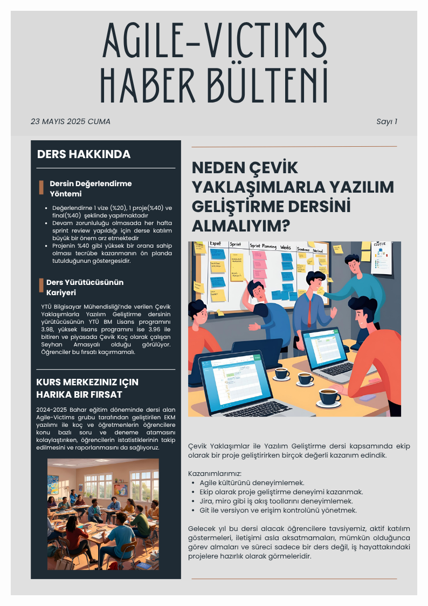

# Etüt Ve Koçluk Merkezi

## Açıklama
2024-2025 Bahar dönemi Çevik Yaklaşımlarla Yazılım Geliştirme dersi dönem projesi olarak yapılmıştır.

## Katkıda Bulunanlar
- [Ahmet Mahir Demirelli](https://github.com/Ahmet-MahirDEMIRELLI)
- [Nijat Majidli](https://github.com/nicat00m20)
- [Ali Mammadli](https://github.com/alimammadli0)
- [Osman Hayek](https://github.com/osmanhayek)
- [Tan Erciyas](https://github.com/Ghurstird)

## Newsletter


## Kullanılan Teknolojiler
- Angular
- Java Spring Boot
- PostgreSQL
- Jira

## Kurulum

### Gereksinimler
- Docker

### Kurulum Adımları

1. **Ana Klasörü Klonla:**
   ```sh
   "git clone https://github.com/Agile-Victims/EKM.git" çalıştırınız.
   ```

2. **Frontend'i Klonla:**
   ```sh
   /EKM içinde "git clone https://github.com/Agile-Victims/EKM.Client.git" çalıştırınız.
   ```

3. **Backend'i Klonla:**
   ```sh
   /EKM içinde "git clone https://github.com/Agile-Victims/EKM.Server.git" çalıştırınız.
   ```

4. **Docker İle Çalıştır:**
   ```sh
   localhost:4200 ve localhost:8080 portunun müsait olduğuna emin olunuz.
   /EKM içinde "docker compose up --build" çalıştırınız.
   "ekm-backend   | Default admin created!" mesajı gözüktüğünde tüm servisler çalışmış demektir.
   ```

5. **Frontend'i Görüntüle:**
   ```sh
   Browser üzerinden http://localhost:4200 adresini ziyaret ediniz.
   ```
   
6. **Koç Girişi Yap:**
   ```sh
   Varsayılan Giriş Bilgileri:
   E-Posta: admin@gmail.com
   Şifre: 123Admin-456
   ```

## Demo
- [EKM Demo](https://www.youtube.com/watch?v=XszozeYOPZI)
